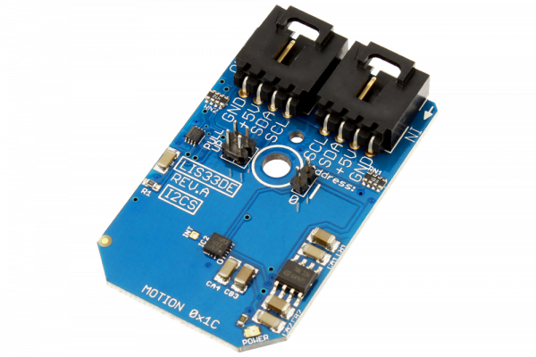

[](https://store.ncd.io/product/lis33de-motion-sensor-3-axis-%C2%B12g%C2%B18g-accelerometer-i2c-mini-module/).

# LIS33DE

Manufactured by STMicroelectronics, the LIS33DE is a low-power three axis linear accelerometer belonging to the “nano” family. The LIS33DE has dynamically user selectable full scales of ±2g/±8g and it is capable of measuring accelerations with an output data rate of 100 Hz or 400 Hz.
This Device is available from www.ncd.io

[SKU: LIS33DE]

(https://store.ncd.io/product/lis33de-motion-sensor-3-axis-%C2%B12g%C2%B18g-accelerometer-i2c-mini-module/)
This Sample code can be used with Raspberry Pi.

Hardware needed to interface LIS33DE 3axis accelometer sensor With Raspberry Pi :

1. <a href="https://store.ncd.io/product/lis33de-motion-sensor-3-axis-%C2%B12g%C2%B18g-accelerometer-i2c-mini-module/">LIS33DE 3axis accelometer sensor</a>

2. <a href="https://store.ncd.io/product/i2c-shield-for-raspberry-pi-3-pi2-with-outward-facing-i2c-port-terminates-over-hdmi-port/">Raspberry Pi I2C Shield</a>

3. <a href="https://store.ncd.io/product/i%C2%B2c-cable/">I2C Cable</a>

## Python

Download and install smbus library on Raspberry pi. Steps to install smbus are provided at:

https://pypi.python.org/pypi/smbus-cffi/0.5.1

Download (or git pull) the code in pi. Run the program.

```cpp
$> python LIS33DE.py
```
The lib is a sample library, you will need to calibrate the sensor according to your application requirement.
